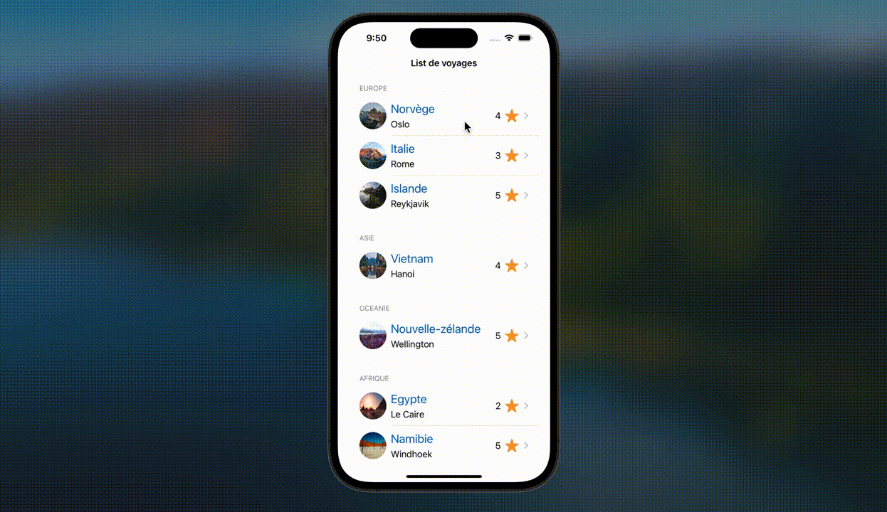

  

# Migrer une interface UIKit vers SwiftUI

 Ce projet vous aide à pratiquer vos compétences en développement iOS en migrant une interface existante construite avec UIKit vers SwiftUI. Vous apprendrez également à gérer le code source avec Git et GitHub pour un développement collaboratif. 

## Fonctionnalités

- **Migration de UIKit vers SwiftUI** : Convertir une interface basée sur UIKit en SwiftUI.  
- **Interface moderne et interactive** : Créer une expérience utilisateur élégante et interactive en utilisant les composants SwiftUI.  
- **Intégration Git et GitHub** : Collaborer et gérer efficacement le code source avec Git et GitHub.

Fonctionnalités de l’application de voyage : inclut des éléments tels que :

- Affichage d’une liste de destinations.  
- Détails pour chaque destination.  
- Localisation des destinations.

## Prérequis

- Un ordinateur macOS.  
- La dernière version de Xcode, disponible gratuitement sur l’App Store.  
- Connaissances de base en Swift et en développement iOS.

## Installation

Clonez le dépôt GitHub sur votre machine locale :

bash
Copy code
git clone https://github.com/your-repository
Ouvrez le projet dans **Xcode** en utilisant le fichier **.xcworkspace**.

## Utilisation

- Explorez le code **UIKit** existant afin de comprendre sa structure.  
- Commencez à migrer l’interface vers **SwiftUI** tout en conservant les fonctionnalités principales.  
- Testez l’application dans le **simulateur iOS** ou sur un appareil physique afin de vous assurer que tout fonctionne correctement.

## Screenshots

| 

 | 

 | 

 |
|:--:|:--:|:--:|
| **List** | **Detailed** | **Map** 

UIKit Interface & SwiftUI Interface

## Demo Video

## Comment ça marche

Le projet commence avec une interface d’application basée sur **UIKit**, que vous migrerez progressivement vers **SwiftUI**.  
Au fur et à mesure de la migration des composants, la syntaxe déclarative de SwiftUI vous permettra de créer une interface moderne et interactive.

- **Affichage des destinations** : Créez une vue SwiftUI pour présenter la liste des destinations de voyage.  
- **Détails des destinations** : Migrez le système d’affichage des détails des destinations, en l’enrichissant grâce aux capacités interactives de SwiftUI.  
- **Localisation** : Intégrez une fonctionnalité pour afficher les emplacements des destinations sur une carte.

## Contribution

Les contributions sont les bienvenues ! Suivez ces étapes pour contribuer :

**Forkez le dépôt** et clonez-le en local :

bash
Copy code
git clone https://github.com/your-repository
**Créez une branche** pour vos modifications :

bash
Copy code
git checkout -b feature-branch-name
Make your changes, and submit a pull request when ready.

## FAQ

**Pourquoi migrer de UIKit vers SwiftUI ?**  
SwiftUI offre une approche plus moderne et déclarative pour créer des interfaces utilisateur. Cela simplifie la création d’interfaces et permet une meilleure intégration avec Swift.

**Quelle version de Xcode est requise ?**  
La dernière version de Xcode est recommandée afin de tirer pleinement parti des fonctionnalités de SwiftUI.

**SwiftUI est-il rétrocompatible avec les anciennes versions d’iOS ?**  
SwiftUI est pris en charge à partir d’iOS 13. Pour les appareils plus anciens, l’application devra conserver certains éléments UIKit.

## Building

bash
Copy code
git clone https://github.com/your-repository
cd project-directory
open Project.xcworkspace
💡 Astuce : Assurez-vous d’utiliser les dernières fonctionnalités de Swift et SwiftUI en maintenant Xcode à jour.

## Licence

Ce projet est sous licence **MIT**. Consultez le fichier LICENSE pour plus de détails.

